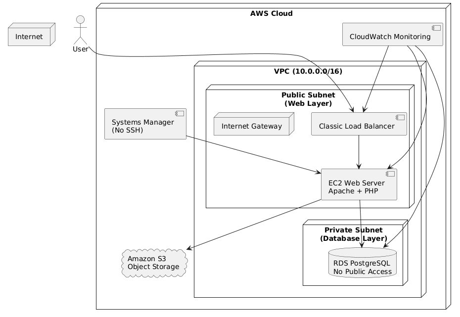
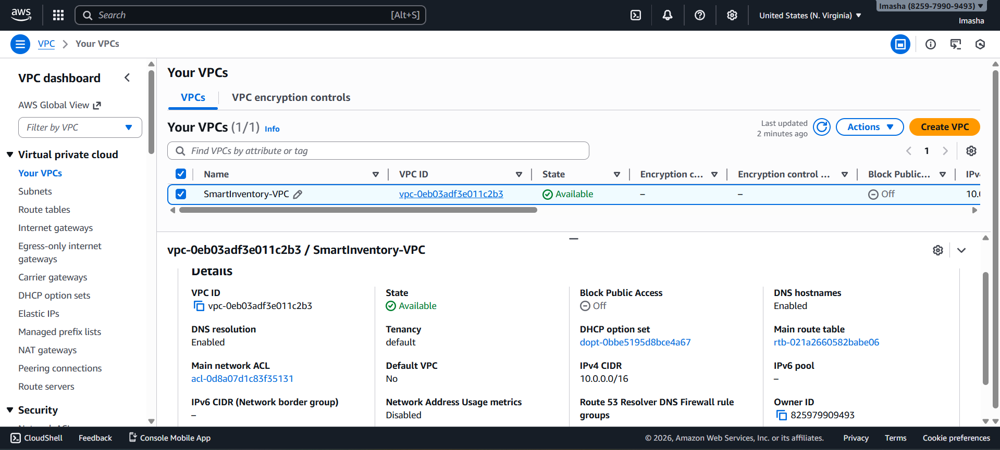
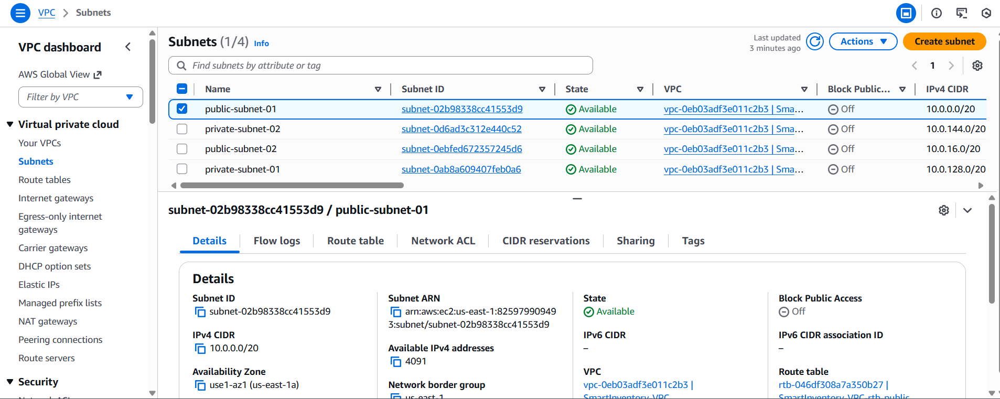
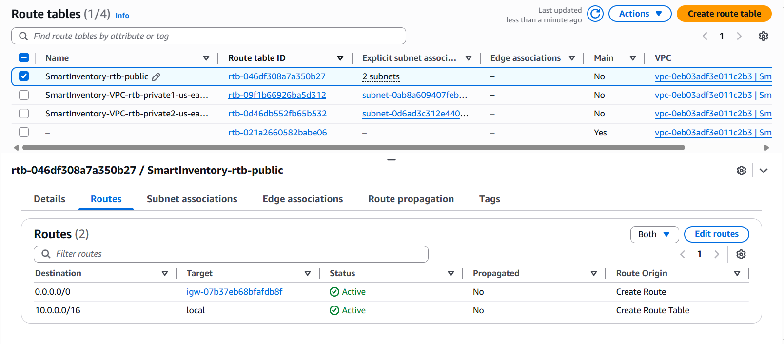
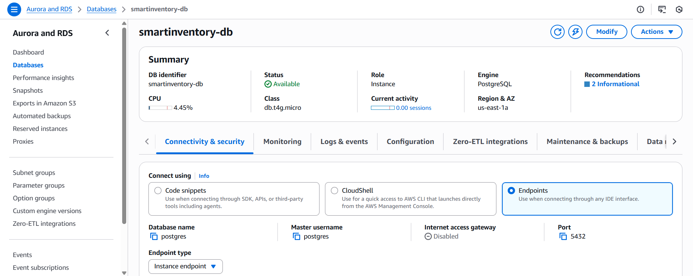
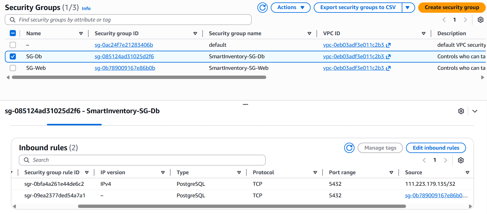
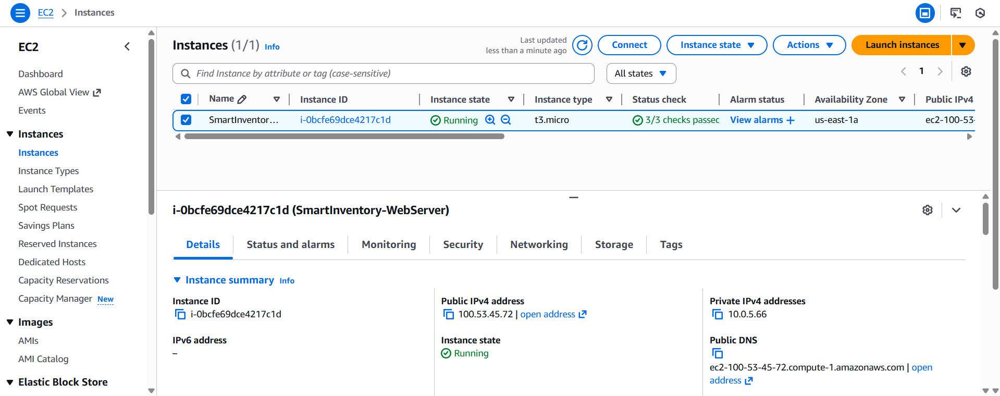
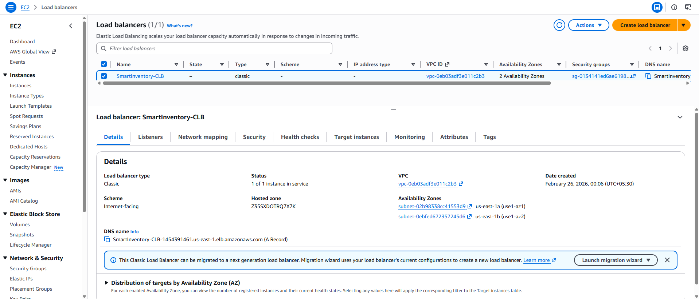
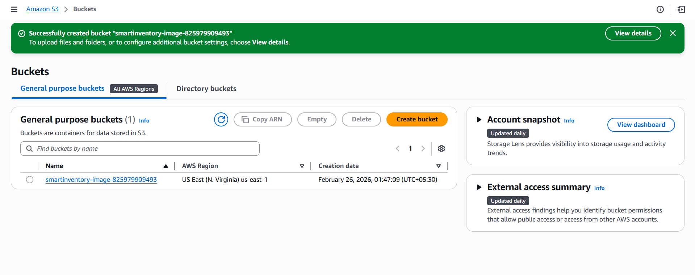

# SmartInventory – AWS Three-Tier Cloud Deployment

## 📌 Project Overview

SmartInventory is a cloud-based inventory management system developed using PHP and PostgreSQL and deployed on Amazon Web Services (AWS) using a secure three-tier architecture.

The system enables:

- Product management (Add / View / Update)
- Image upload integration using Amazon S3
- Secure database storage using Amazon RDS (PostgreSQL)
- High availability through Load Balancer
- Secure administration using AWS Systems Manager
- Monitoring and performance tracking using CloudWatch

This project demonstrates real-world cloud infrastructure design, network segmentation, security configuration, and service integration.

---

## 🏗️ Cloud Architecture

The system follows a structured three-tier architecture:

### 🔹 Web Tier (Public Subnet)

- Classic Load Balancer
- EC2 Instance (Apache + PHP)

### 🔹 Application Layer

- PHP backend logic
- Handles business processing and DB communication

### 🔹 Database Tier (Private Subnet)

- Amazon RDS (PostgreSQL)
- No public access
- Restricted via Security Groups

### 🔹 Supporting AWS Services

- **Amazon S3** – Product image storage
- **AWS Systems Manager** – Secure instance management
- **Amazon CloudWatch** – Monitoring & performance metrics

### 📊 Architecture Diagram

The complete architecture diagram is included below:


---

## 🔐 Security Implementation

- RDS deployed in private subnet
- Database not publicly accessible
- Security Group allows PostgreSQL (5432) only from Web Security Group
- SSH port not exposed to public
- Instance managed using AWS Systems Manager
- Proper route table separation between public and private layers

---

## 🛠️ Technologies Used

- PHP
- PostgreSQL
- Apache Web Server
- Amazon EC2
- Amazon RDS
- Amazon S3
- Classic Load Balancer
- AWS Systems Manager
- Amazon CloudWatch
- Custom VPC Networking

---

## 📂 Project Structure

```
smartinventory-aws-three-tier/
│
├── assets/                                 # Project documentation and architecture details
│   ├── smartinventory.sql                  # Database file
│   ├── style.css                           # stylesheet file for website design
│
├── docs/                                   # Project documentation and architecture details
│   ├── smartinventory_final_report.pdf     # The complete detailed documentation of this project
│   ├── cloud-architecture.png              # shows the project's architecture
│
├── uploads/                                # Temporary local storage for product images before S3 upload
│
├── add_product.php                         # Form page for adding new products to the inventory
├── db.php                                  # Database connection file that handles PostgreSQL connectivity
├── delete_product.php                      # Handles removal of products from the inventory database
├── index.php                               # Main landing page that displays all inventory products
│
├── screenshots/                            # Contains AWS configuration screenshots for documentation
│
└── README.md                               # Project overview and instructions
```

---

## 🚀 Deployment Steps

1. Local Application Development

- The SmartInventory system was first developed and tested locally using PHP, Apache, and PostgreSQL. Core features such as product management and image handling were validated before moving to cloud deployment.

2. Custom VPC Creation

- A custom VPC (CIDR: 10.0.0.0/16) was created to isolate cloud resources and define a structured network environment.
  

3. Public and Private Subnet Configuration

- Two public subnets were created for the web layer and two private subnets were created for the database layer to enforce network segmentation and security best practices.
  

4. Route Tables & Internet Gateway Configuration

- An Internet Gateway was attached to the VPC.
- Public subnets were associated with a route table containing:
  - 0.0.0.0/0 → Internet Gateway
- Private subnets were associated with a separate route table without direct internet access.
  

5. Amazon RDS Deployment (Private Subnet)

- Amazon RDS PostgreSQL was launched inside the private subnet using a modified DB Subnet Group containing only private subnets. Public access was disabled to prevent direct internet exposure.
  

6. Security Group Configuration

- Two security groups were created:
  - SG-Web → Allows HTTP (80) and HTTPS (443) from 0.0.0.0/0
  - SG-DB → Allows PostgreSQL (5432) only from SG-Web
- This ensures the database is accessible only from the EC2 instance.
  

7. EC2 Instance Deployment

- An EC2 instance was launched in the public subnet and attached to SG-Web. The instance was configured to communicate securely with the RDS instance in the private subnet.
  

8. Apache & PHP Installation

- Inside the EC2 instance, Apache and PHP were installed using the appropriate package manager (Amazon Linux). The PHP PostgreSQL driver was installed to enable database connectivity.

9. Database Connectivity Configuration

- The application’s db.php file was updated with the RDS endpoint, database name, and credentials. Connectivity was verified to ensure successful communication between EC2 and RDS over port 5432.

10. Classic Load Balancer Configuration

- Due to account restrictions preventing Application Load Balancer creation, a Classic Load Balancer was configured.
  - Listener: HTTP (80)
  - Health Check configured
  - EC2 instance registered as backend target
- This enables traffic distribution and improves availability.
  

11. Amazon S3 Integration

- An S3 bucket was created for product image storage. The EC2 instance was granted access using IAM role permissions. The application was updated to upload and retrieve images from S3.
  

12. Monitoring Using CloudWatch

- Amazon CloudWatch was used to monitor:
  - EC2 CPU utilization
  - RDS metrics
  - Load balancer health checks
- This ensures operational visibility and performance tracking.

---

## 📄 Full Project Report

The complete detailed documentation of this project, including:

- Network Implementation
- Database Migration
- Load Balancer Configuration
- Object Storage Integration
- Monitoring & Performance Management
- Security Configuration
- Challenges Faced

is available in the **[docs](docs/smartinventory_final_report.pdf)** folder:

```
/docs
└── smartinventory_final_report.pdf
```

---

## ⚠️ Academic Purpose

This project was developed as part of a cloud computing academic assignment to demonstrate practical implementation of AWS infrastructure and secure deployment strategies.

---
